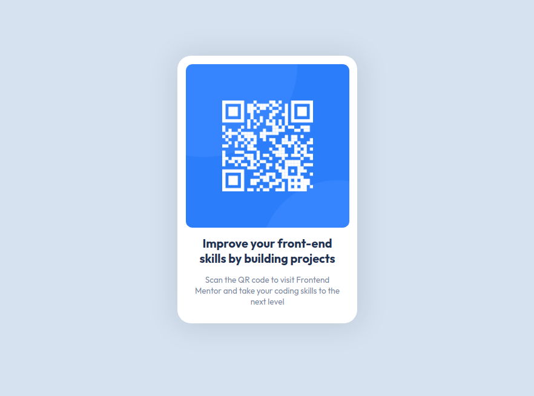

# Frontend Mentor - QR code component solution

## Table of contents

- [Overview](#overview)
  - [Screenshot](#screenshot)
  - [Links](#links)
- [My process](#my-process)
  - [Built with](#built-with)
  - [What I learned](#what-i-learned)
  - [Continued development](#continued-development)
  - [Useful resources](#useful-resources)
- [Author](#author)
- [Acknowledgments](#acknowledgments)

---

## Overview

### Screenshot

### Links

- Solution URL: https://github.com/JojoRider/FEM-QR_code_component
- Live Site URL: https://jojorider.github.io/FEM-QR_code_component/

---

## My process

1. Analyse of the design schema to identify the different sections and how to built the right sections in the HTML file
2. First version of sections and classes
3. Starting of building the style in CSS, from top to bottom
4. After a little bit of research, I fine tuned my classes and section in the HTML file, it was working but not optimized
5. I didn't pay much attention to the required size until now, mostly because I didn't learn yet how to do it. So let's get back to the research phase, and learned a bit of the viewport set up.
6. Correction of the size of the project

### Built with

- Semantic HTML5 markup
- CSS custom properties
- Flexbox

### What I learned

Use this section to recap over some of your major learnings while working through this project. Writing these out and providing code samples of areas you want to highlight is a great way to reinforce your own knowledge.

### Continued development

I have not yet started to learn the specificities of mobile first development (will come later in my path) but definitely room of improvement regarding the usage/occupation of a page by content.

---

## Author

- Frontend Mentor - [@JojoRider](https://www.frontendmentor.io/profile/JojoRider)